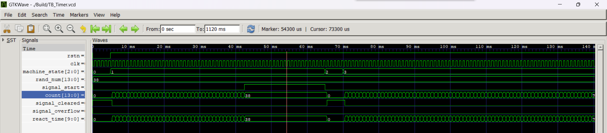
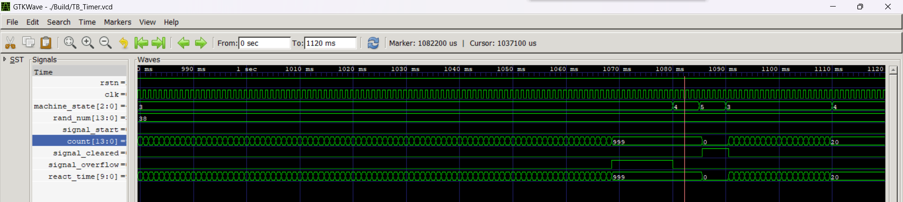

# 2024年寒假练 - 基于 FPGA 设计的反应时间测试系统

## 视频展示

iframe

## 活动链接

<https://www.eetree.cn/activity/15>

## 项目链接

Github:  <https://github.com/kokkoroQwQ/Reaction-Time-Testing/> </br>
电子森林: <https://github.com/kokkoroQwQ/Reaction-Time-Testing/>

## 项目需求

设计一款反应时间测试系统，测试两个队友（队友A和队友B）看到LED亮起后按键的时间，将响应时间显示在数码管上，每个人测量8次做平均，并将两个人的响应时间做对比，显示出哪一方赢得比赛。


## 需求分析

### 硬件外设资源

* 数码管：显示每一次测试的响应时间，两个队友共用
* LED：每一轮测试，相应轮次的LED灯亮起作为指示，第一次测试L1亮起，第二次测试L2亮起……第八次测试L8亮起
* RGB三色灯：指示正在测试的队友， RGB1 - 队友A，RGB2 - 队友B
  * 绿色：测试过程中
  * 蓝色：完成8次测试
  * 红色：完成平均
  * 白色：比赛结果，白色高亮：赢得比赛；白色暗淡：输掉比赛
* 开关SW1：拨到上面测试队友A，拨到下面测试队友B
* 开关SW4：系统复位键
* 轻触按键：
  * K1：启动
  * K2：响应
  * K3：平均
  * K4：比较

### 游戏规则

1. 按下“启动”按钮后，两个 7 段显示屏立即设置为显示全0，然后随机一段时间后（大约1 到10秒），相应测试轮次的“立即反应”LED 亮起，并启动毫秒计时器，数码管开始显示计时器值（以毫秒为单位递增）。
2. “立即反应”LED 亮起后，队友必须尽快按下“响应”按钮来停止计时器。 停止的计时器将包含“立即反应”LED亮起和按钮按下之间的毫秒数，并且该时间将显示在数码管上。
3. 再次按下“启动”按钮将清除计时器并开始新的测试
4. 重复单个反应时间测量八次，每一个测试，相应的8个LED中的一个亮起，并将八个测量的反应时间值存储在临时保持寄存器中。
5. 按下“平均”按钮可平均8次的测量值，并将平均后的数值显示在数码管上，8个LED全部亮起。
6. 切换队友 - 将SW1的状态改变，重复测试8次，并平均八次的测试结果
7. 按下“比较”按钮，通过RGB三色灯指示哪个队友获胜（平均用时最短），并在数码管上显示相应的响应时间

## 实现方式

### 硬件平台

* 基于Lattice MXO2的小脚丫FPGA核心板 - Type C接口

### 软件工具

* 语言：Verilog
* 仿真：VSCode + Icarus Verilog + GTKWave
* 目标文件生成：思德普 WebIDE

### 项目框架/设计思路

本项目采用模块化、层次化的设计思想，将系统分解为如下几个模块：
时钟分频：将12MHz的系统时钟分频为用于毫秒计时器的1KHz、用于数码管滚动显示的2Hz时钟。

* 状态机：业务逻辑所在模块。接收用户的按键、开关，计时器的随机等待时间到达、反应超时等输入信号，进行系统状态转移，记录测量和比赛的结果，并控制输出外设。
* 毫秒计时器：进行以毫秒为单位的上升计时，并根据系统状态，产生随机等待时间到达或反应超时（上限为999ms）信号
* 伪随机数发生器：产生用于用户按下启动按键到相应测试轮次LED亮起之间的随机等待时间毫秒数（1000~9999ms）。
* 数码管控制：内含二进制数转BCD码模块、7段数码管编码器、循环移位寄存器，根据系统状态，进行2位7段数码管的静态、实时或滚动显示。
* RGB LED控制：内含PWM发生器，根据系统状态和比赛结果，控制2位* RGB LED的颜色和亮度。
* LED控制：根据系统状态，控制8位LED的亮灭。
  
## 功能框图

### 系统框架示意图


### 状态机状态转移图


相关说明：

* signal_action：玩家按下启动键
* signal_react：玩家按下响应键
* signal_average：玩家按下平均键
* signal_compare：玩家按下比较键
* signal_start：随机等待时间结束，开始计时反应时间
* signal_overflow：反应超时
* signal_cleared：计时器清零完成
* IDLE：系统复位后，状态机初始状态
* WAIT：等待一段随机时间（1000~9999ms）
* CLR_CNT1、CLR_CNT2：等待计时器清零完成
* START：正在测量玩家反应时间
* STOARGE：存储玩家单次反应时间
* AVERAGE：对当前玩家的8次测试结果进行平均
* COMPARE：比较两名玩家的时间，并显示比赛胜负结果。此为状态机的最终状态

## 关键代码及说明

下面仅展示顶层文件和状态机模块的代码。完整代码于附件中的 Src 文件夹中，此处不再赘述。

相关解释说明已在变量名和注释中得到较好体现。

Top.v

``` Verilog
module Top (
    input  wire       clk_12MHz,
    input  wire [3:0] key, swi,
    output wire [7:0] led,
    output wire [2:0] rgb1, rgb2,
    output wire [8:0] seg1, seg2
);
    // 系统输入
    wire   sys_clk, rstn;
    assign sys_clk = clk_12MHz;   // 系统时钟
    assign rstn    = swi[3];      // 系统复位

    // 状态机输入信号
    wire   signal_action, signal_react, signal_average, signal_compare;   // 4 个按键：启动、反应、平均、比较
    wire   signal_start,  signal_overflow, signal_cleared;                // start: 随机延时结束，开始测量计时
                                                                          // overflow: 测量超时溢出
                                                                          // cleared: 计时器清零完成
    assign signal_action  = ~key[0];
    assign signal_react   = ~key[1];
    assign signal_average = ~key[2];
    assign signal_compare = ~key[3];

    // 状态机输入
    wire [6:0] signals;
    assign signals = {signal_action, signal_react, signal_average, signal_compare, 
                      signal_start, signal_overflow, signal_cleared};
    
    wire   cur_player;
    assign cur_player = swi[0];         // 切换队友

    wire [9:0] react_time;             // 单次测量时间

    // 状态机输出
    wire [2:0]  machine_state;
    wire [9:0]  avr_react_time_A, avr_react_time_B;
    wire [2:0]  test_turn_A, test_turn_B;

	// 状态机
    StateMachine u_StateMachine(
    	.clk               (sys_clk          ),
        .rstn              (rstn             ),
        .cur_player        (cur_player       ),
        .signals           (signals          ),
        .react_time        (react_time       ),
        .out_machine_state (machine_state    ),
        .avr_react_time_A  (avr_react_time_A ),
        .avr_react_time_B  (avr_react_time_B ),
        .test_turn_A       (test_turn_A      ),
        .test_turn_B       (test_turn_B      )
    );
    
    // 时钟分频
    wire clk_1KHz, clk_2Hz;
    ClockDivider u_ClockDivider (
    	.rstn      (rstn     ),
        .clk_12MHz (clk_12MHz),
        .clk_1KHz  (clk_1KHz ),
        .clk_2Hz   (clk_2Hz  )
    );

    // 随机数生成
    // 每当状态机状态 machine_state 转移到 WAIT 后，输出一个新的随机数 rand_num
    wire [13:0] rand_num;
    Random u_Random(
    	.clk           (sys_clk       ),
        .rstn          (rstn          ),
        .machine_state (machine_state ),
        .rand_num      (rand_num      )
    );
    
    // 计数器，既作延时，也作测量
    // 当 machine_state = WAIT，若内部计数值等于随机数rand_num，则输出信号signal_start为高
    // 当 machine_state = START， 若内部计数值等于999，则输出信号signal_overflow为高
    // 当 machine_state = CLR_CNT1 或CLR_CNT2，内部计数值清零
    // 当内部计数值为零时， 输出信号signal_cleared为高
    Timer u_Timer(
    	.clk             (clk_1KHz        ),
        .rstn            (rstn            ),
        .machine_state   (machine_state   ),		// 输入，状态机状态
        .rand_num        (rand_num        ),		// 输入，1000~9999随机数
        .signal_start    (signal_start    ),		// 输出，随机等待时间结束
        .signal_overflow (signal_overflow ),		// 输出，反应时间超时
        .signal_cleared  (signal_cleared  ),		// 输出，计数器清零完成
        .react_time      (react_time      )			// 输出，反应时间
    );

    // 数码管显示控制
    Display u_Display(
    	.clk              (sys_clk          ),
        .rstn             (rstn             ),
        .clk_2Hz          (clk_2Hz          ),
        .cur_player       (cur_player       ),		// 输入，当前玩家
        .machine_state    (machine_state    ),		// 输入，状态机状态
        .react_time       (react_time       ),		// 输入，反应时间
        .avr_react_time_A (avr_react_time_A ),		// 输入，玩家A的平均反应时间
        .avr_react_time_B (avr_react_time_B ),		// 输入，玩家B的平均反应时间
        .seg1             (seg1             ),		// 输出，接数码管1
        .seg2             (seg2             )			// 输出，接数码管2
    );

    // RGB 控制
    RGB u_RGB(
    	.clk              (sys_clk          ),
        .rstn             (rstn             ),
        .cur_player       (cur_player       ),		// 输入，当前玩家
        .machine_state    (machine_state    ),		// 输入，状态机状态
        .test_turn_A      (test_turn_A      ),		// 输入，A玩家的测试轮次 0~7
        .test_turn_B      (test_turn_B      ),		// 输入，B玩家的测试轮次 0~7
        .avr_react_time_A (avr_react_time_A ),		// 输入，玩家A的平均反应时间
        .avr_react_time_B (avr_react_time_B ),		// 输入，玩家B的平均反应时间
        .rgb1             (rgb1             ),		// 输出，接RGB LED 1
        .rgb2             (rgb2             )			// 输出，接RGB LED 2
    );
    
    // LED 控制
    LED u_LED(
    	.clk           (sys_clk       ),
        .rstn          (rstn          ),
        .cur_player    (cur_player    ),		// 输入，当前玩家
        .machine_state (machine_state ),		// 输入，状态机状态
        .test_turn_A   (test_turn_A   ),		// 输入，A玩家的测试轮次 0~7
        .test_turn_B   (test_turn_B   ),		// 输入，B玩家的测试轮次 0~7
        .led           (led           )			// 输出，接8位LED​
    );

endmodule //Top
```

StateMachine.v

```Verilog
module StateMachine (
    input  wire       clk, rstn,
    input  wire       cur_player,
    input  wire [6:0] signals,
    input  wire [9:0] react_time,

    output wire [2:0] out_machine_state,
    output wire [9:0] avr_react_time_A, avr_react_time_B,
    output wire [2:0] test_turn_A, test_turn_B
);

    // 状态机输入信号
    wire   signal_action, signal_react, signal_average, signal_compare;   // 4 个按键：启动、反应、平均、比较
    wire   signal_start,  signal_overflow, signal_cleared;                // start: 随机延时结束，开始测量计时
                                                                          // overflow: 测量超时溢出
                                                                          // cleared: 计时器清零完成

    assign signal_action  = signals[6];
    assign signal_react   = signals[5];
    assign signal_average = signals[4];
    assign signal_compare = signals[3];

    assign signal_start    = signals[2];
    assign signal_overflow = signals[1];
    assign signal_cleared  = signals[0];

    // 状态机参数
    parameter IDLE     = 3'd0;		// 状态机状态 空闲​ 系统复位后所处状态
    parameter WAIT     = 3'd1;		// 状态机状态 等待随机时间到达
    parameter CLR_CNT1 = 3'd2;		// 状态机状态 等待计时器清零完成
    parameter START    = 3'd3;		// 状态机状态 开始测量，毫秒计时器记录反应时间
    parameter STORAGE  = 3'd4;		// 状态机状态 存储单次反应时间
    parameter CLR_CNT2 = 3'd5;		// 状态机状态 等待计时器清零完成
    parameter AVERAGE  = 3'd6;		// 状态机状态 平均玩家的8次测量结果
    parameter COMPARE  = 3'd7;		// 状态机状态 比较​两名玩家测量结果
    parameter PLAYER_A = 1'b1;		// 玩家A​
    parameter PLAYER_B = 1'b0;		// 玩家B

    // 状态机变量
    reg  [2:0]  machine_state;          // 状态寄存器
    reg  [12:0] sum_react_time [1:0];   // 累加时间寄存器
    reg  [2:0]  test_turn      [1:0];   // 测试轮次寄存器

    assign out_machine_state = machine_state;
    assign sum_react_time_A  = sum_react_time[PLAYER_A];
    assign sum_react_time_B  = sum_react_time[PLAYER_B];
    assign avr_react_time_A  = sum_react_time[PLAYER_A][12:3];
    assign avr_react_time_B  = sum_react_time[PLAYER_B][12:3];
    assign test_turn_A       = test_turn[PLAYER_A];
    assign test_turn_B       = test_turn[PLAYER_B];

    // 状态转移逻辑
    always @(posedge clk or negedge rstn) begin
        if (!rstn)
            machine_state <= IDLE;
        else begin
            case (machine_state)
            IDLE   : begin
                sum_react_time[PLAYER_A] <= 12'd0;
                sum_react_time[PLAYER_B] <= 12'd0;
                test_turn[PLAYER_A]      <= 3'd0;
                test_turn[PLAYER_B]      <= 3'd0;

                machine_state <= signal_action ? WAIT : machine_state;
            end
            WAIT   : begin
                machine_state <= signal_start ? CLR_CNT1 : machine_state;
            end
            CLR_CNT1: begin
                machine_state <= signal_cleared ? START : machine_state;
            end
            START  : begin
                if (signal_react || signal_overflow) begin
                    machine_state <= STORAGE;
                    sum_react_time[cur_player] <= sum_react_time[cur_player] + react_time;
                end
                else machine_state <= machine_state;
            end
            STORAGE: begin
                if (test_turn[cur_player] == 3'd7 && signal_average)
                    machine_state <= AVERAGE;
                else if (test_turn[cur_player] != 3'd7 && signal_action) begin
                    machine_state <= CLR_CNT2;
                    test_turn[cur_player] <= test_turn[cur_player] + 3'd1;
                end
                else machine_state <= machine_state;
            end
            CLR_CNT2: begin
                machine_state <= signal_cleared ? WAIT : machine_state;
            end
            AVERAGE: begin
                if (test_turn[PLAYER_A] == 3'd7 && test_turn[PLAYER_B] == 3'd7 && signal_compare)
                    machine_state <= COMPARE;
                else if (test_turn[cur_player] != 3'd7 && signal_action)
                    machine_state <= WAIT;
                else machine_state <= machine_state;
            end
            COMPARE: machine_state <= machine_state;
            default: machine_state <= IDLE;
            endcase
        end
    end

endmodule //StateMachine
```

## 仿真波形

仿真激励文件位于附件中的 TestBench 文件夹，文件命名规则为“TB_模块名.v”，例如状态机的仿真激励文件为“TB_StateMachine.v”。此处仅展示仿真波形图和简要说明。

* 时钟分频（ClockDivider）


仿真中的输入时钟频率设置晶振的 12MHz。仿真波形中 clk_1KHz 的周期为1ms，clk_2Hz 的周期为500ms，满足设计需求。

* 状态机（StateMachine）

可见状态机状态和测试轮次寄存器都在输入信号的激励下按照预期发生变化，满足设计需求。

* 毫秒计时器（Timer）

可见，状态机处于WAIT（值为1）状态时，当计数值 count = rand_num，计时器发出 signal_start 信号；当状态机处于CLR_CNT1（值为2）状态时，计数值清零。

可见，状态机处于 START（值为3）状态时，当计数值 count = 999，计时器发出 signal_overflow 信号；当状态机处于CLR_CNT2（值为5）状态时，计数值清零。状态机处于 STORAGE（值为4）状态时，计数值保持。

* 随机数发生器（Random）


* 二进制转BCD（Binary2BCD）


* 数码管编码器（SegmentEncoder）

将数字0~9编码为数码管段码。

* 循环移位寄存器（CircleShift）

输入的三个十进制数分别是 in_digit_2、in_digit_1 和 in_digit_0，可见输出的两个数位以“in_digit_2 -> in_digit_1 -> in_digit_0 -> A（10进制中的10） -> in_digit_2”的顺序轮转，其中“A”在数码管编码器中设计为不显示。将两个输出接到数码管编码器的两个输入，便可实现两位数码管滚动显示 3 位数的效果。

* RGB LED控制（RGB）

根据状态机状态和测试轮次寄存器的变化，改变2个RGB LED的颜色和亮度。由仿真波形可知，满足设计需求。

* PWM生成器（PWM）

亮度挡位bright为低时，PWM占空比很小，对应RGB LED亮度低；挡位bright为高，PWM占空比接近1，对应RGB LED亮度高。

* LED控制（LED）

8个LED均为低电平点亮，由波形图可见，当系统处于测量状态时，8个LED依照测试轮次依次点亮；当系统处于平均状态时，8个LED全亮，符合设计需求。

## FPGA资源使用情况

使用思德普 WebIDE 进行FPGA映射，可得到运行日志 run.log。其中 FPGA 资源使用报告如下：

```C
Design Summary:
Number of registers: 188 out of 4635 (4%)
PFU registers: 188 out of 4320 (4%)
PIO registers: 0 out of 315 (0%)
Number of SLICEs: 249 out of 2160 (12%)
SLICEs as Logic/ROM: 249 out of 2160 (12%)
SLICEs as RAM: 0 out of 1620 (0%)
SLICEs as Carry: 84 out of 2160 (4%)
Number of LUT4s: 495 out of 4320 (11%)
Number used as logic LUTs: 327
Number used as distributed RAM: 0
Number used as ripple logic: 168
Number used as shift registers: 0
Number of PIO sites used: 39 + 4(JTAG) out of 105 (41%)
Number of block RAMs: 0 out of 10 (0%)
Number of GSRs: 1 out of 1 (100%)
EFB used : No
JTAG used : No
Readback used : No
Oscillator used : No
Startup used : No
POR : On
Bandgap : On
Number of Power Controller: 0 out of 1 (0%)
Number of Dynamic Bank Controller (BCINRD): 0 out of 6 (0%)
Number of Dynamic Bank Controller (BCLVDSO): 0 out of 1 (0%)
Number of DCCA: 0 out of 8 (0%)
Number of DCMA: 0 out of 2 (0%)
Number of PLLs: 0 out of 2 (0%)
Number of DQSDLLs: 0 out of 2 (0%)
Number of CLKDIVC: 0 out of 4 (0%)
Number of ECLKSYNCA: 0 out of 4 (0%)
Number of ECLKBRIDGECS: 0 out of 2 (0%)
```

## 遇到的问题

1. 查阅资料可知，人的反应时间一般在 200~300ms，而数码管只有2个，不能够直接显示三位数。此次活动群的群友提议可以将7段数码管中的每段 LED 的亮灭视作1和0，如此可以表示 2^14个数字，但这种方式太不直观。也有群友提出将时间单位改为 10ms，但这不符合题目中以毫秒为单位的要求。在后续的思考中，本人联想到专业课中《通信原理》曾多次出现的时分复用概念，将其应用到数码管显示中，于是便设计了10进制数的循环移位寄存器，使得两位数码管可以显示更多位的数。
2. 由于要使用到按键，项目初期时一直在考虑是否需要加入按键消抖功能。后来在构建好状态机的状态转移图后发现，由于每个按键的功能都是单一且明确的，其抖动并不会使得状态机状态发生连续转移，于是不再添加消抖功能。这虽不算什么难题，但也是一个小小的收获吧。

## 未来的计划

该项目设计当前并未对一些用户违规操作进行限制，例如前一名被测者未测试完成8次就提前切换被试者。后续如有空闲，可以添加一些防止用户用户错误操作，并进行告警的安全冗余功能，提高系统可靠性。

## 团队成员

Violeta : violet2021@foxmail.com