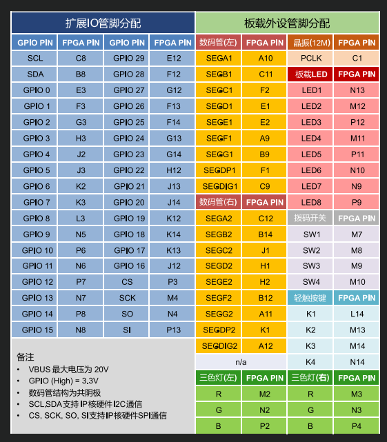
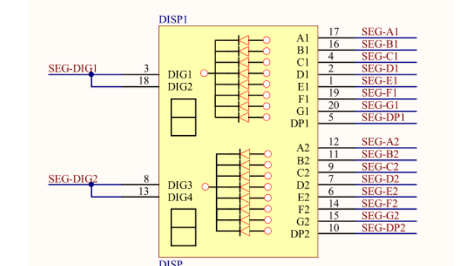

# 笔记

## 任务链接

<https://www.eetree.cn/vendorProject/preview/411>

## 项目链接

<https://github.com/kokkoroQwQ/Reaction-Time-Testing/>

## 板子特点

1. 这块 FPGA 的引脚在复位状态下似乎是高阻态
2. 按键按下是低电平
3. 数码管是共阴极的
4. 所有 LED 的负极接 IO

## 任务详情

1. 按下“启动”按钮后，两个7 段显示屏立即设置为显示全0，然后随机一段时间后（大约1 到10秒），相应测试轮次的“立即反应”LED 亮起，并启动毫秒计时器，数码管开始显示计时器值（以毫秒为单位递增）。
2. “立即反应”LED 亮起后，队友必须尽快按下“响应”按钮来停止计时器。 停止的计时器将包含“立即反应”LED亮起和按钮按下之间的毫秒数，并且该时间将显示在数码管上。
3. 再次按下“启动”按钮将清除计时器并开始新的测试
4. 重复单个反应时间测量八次，每一个测试，相应的8个LED中的一个亮起，并将八个测量的反应时间值存储在临时保持寄存器中。
5. 按下“平均”按钮可平均8次的测量值，并将平均后的数值显示在数码管上，8个LED全部亮起。
6. 切换队友 - 将SW1的状态改变，重复测试8次，并平均八次的测试结果
7. 按下“比较”按钮，通过RGB三色灯指示哪个队友获胜（平均用时最短），并在数码管上显示相应的响应时间

## 资源分配

1. 数码管：显示每一次测试的响应时间，两个队友共用
2. LED：每一轮测试，相应轮次的LED灯亮起作为指示，第一次测试L1亮起，第二次测试L2亮起。。。第八次测试L8亮起
3. RGB三色灯：指示正在测试的队友， RGB1 - 队友A，RGB2 - 队友B
    * 绿色 - 测试过程中
    * 蓝色 - 完成8次测试
    * 红色 - 完成平均
    * 白色 - 比赛结果，白色高亮：赢得比赛；白色暗淡：输掉比赛
4. 开关SW1: 拨到上面测试队友A，拨到下面测试队友B
5. 轻触按键：
    * K1：启动
    * K2：响应
    * K3：平均
    * K4：比较

## 模块规划

1. 1ms 定时器，用于测量单次反应时间
2. 数码管驱动（需要滚动显示，以显示 3 位十进制 ms 时长）
3. 按键消抖 x4
4. 三色 LED 驱动
5. PWM 产生器（控制三色 LED 亮度）
6. 拨码开关 x4

## 项目日志

* 2024-02-01 晚上 [debug] : 补上除 Top 模块外所有的模块仿真、编写了自动化仿真python脚本
* 2024-02-01 凌晨 [debug] : 完成全部预期功能，并成功上机验证
* 2024-01-31 [debug] : 还在编写 Top 模块
* 2024-01-30 [debug] : 编写 Top 模块, 去除按键消抖模块（发现有了状态机并不需要）
* 2024-01-29 [happy] : 出去玩，没碰
* 2024-01-28 [moyu] : 出去玩，没碰
* 2024-01-27 [gaming] : 玩游戏，没碰
* 2024-01-26 [debug] : 继续改进各模块，设计Top系统状态机
* 2024-01-25 [debug] : 改进各模块，初步设计 Top
* 2024-01-24 [debug] : 完成伪随机数生成器
* 2024-01-23 [debug] : 完成了移位寄存器的改进，PWM、RGB LED、按键消抖模块的设计综合、上机验证。
* 2024-01-22 [debug] : 配置好 vscode + iverilog + gtkwave 环境，完成了数码管滚动显示3位数字、分频器、1 位 10 进制计数器的设计、综合、上机验证
